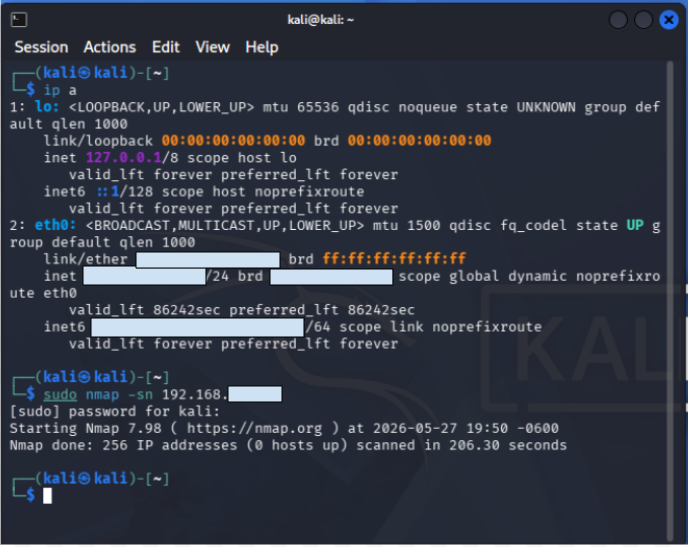
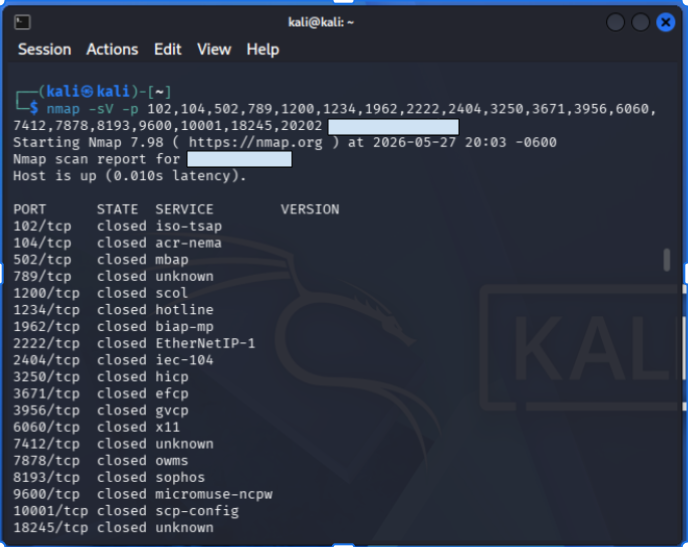
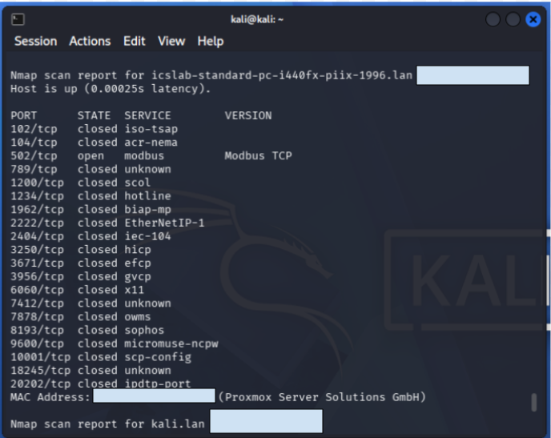
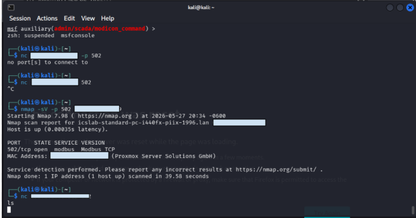
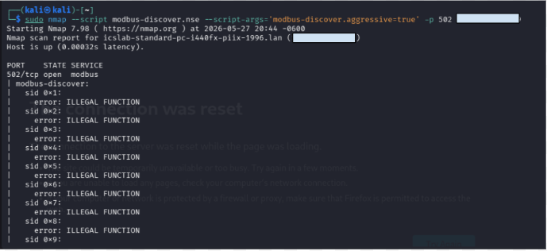
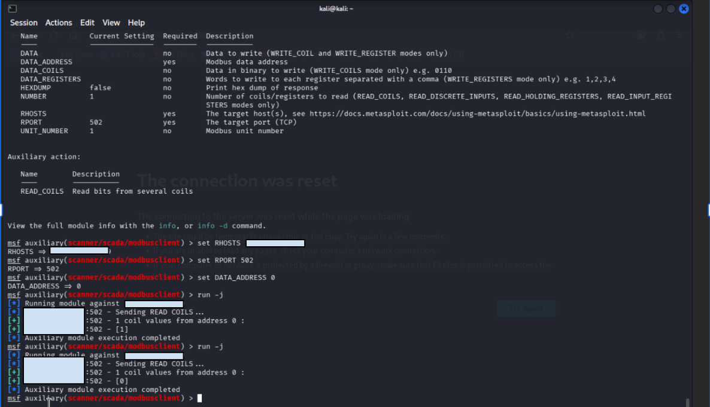
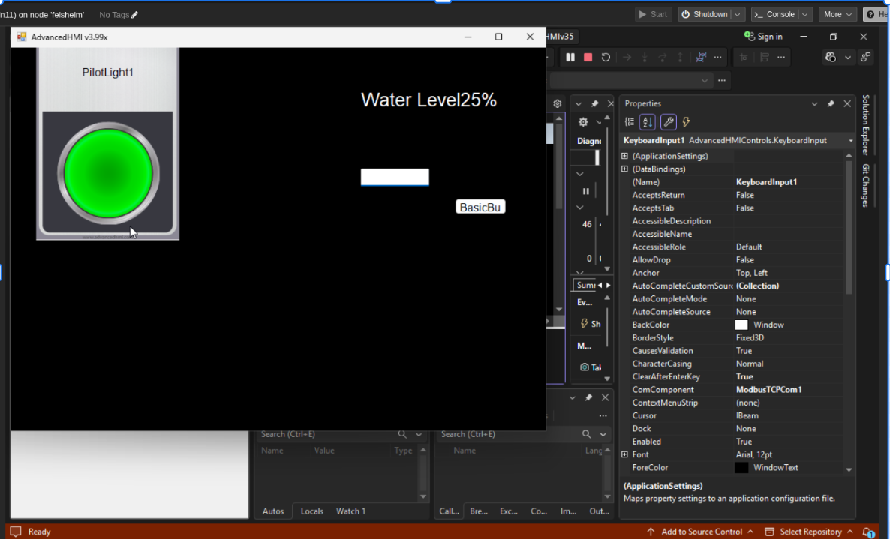
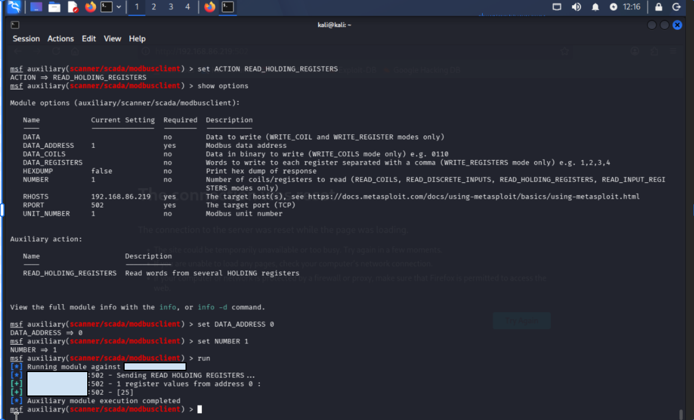

# Attack 1 – PLC Discovery and Modbus Enumeration

## Objective

The goal of Attack 1 was to identify industrial devices on the network, discover exposed ICS services, and determine what information could be obtained without authentication.

This attack focused on:

* Discovering industrial devices
* Identifying exposed ICS protocols
* Enumerating Modbus services
* Reading PLC process information remotely

---

# Network Discovery

The first step was determining what systems existed on the same network segment.

I used the following command to identify my IP address and subnet information:

```bash
ip a
```

After identifying the subnet, I performed host discovery using:

```bash
nmap -sn <subnet>
```

The scan did not return any active hosts. This demonstrated an important lesson: many systems do not respond to ICMP requests, meaning host discovery alone is not always sufficient.

### Figure 1



*Identifying local network information using the `ip a` command.*

### Figure 2



*Host discovery scan returning no results, demonstrating the limitations of ICMP-based discovery.*

---

# Researching ICS and OT Protocols

Since traditional host discovery was unsuccessful, I shifted focus toward identifying common Industrial Control System (ICS) and Operational Technology (OT) protocols.

Research showed that many industrial environments use protocols such as:

* Modbus TCP
* EtherNet/IP
* DNP3
* Siemens S7
* BACnet

Many of these protocols were designed for trusted environments and often lack authentication and encryption mechanisms.

Instead of searching for hosts directly, I began searching for systems exposing common industrial services.

---

# Discovering Modbus TCP

Using Nmap service detection against common ICS ports, I discovered a device exposing:

```text
502/tcp open modbus
```

Port 502 is the default port used by Modbus TCP, one of the most widely deployed industrial communication protocols.

At this point I could conclude:

* An industrial communication service was present.
* The target was likely functioning as a PLC or ICS device.
* Modbus TCP was reachable from my system.

### Figure 3



*Service detection identifying an exposed Modbus TCP service on port 502.*

---

# Understanding the Security Risks

Further research revealed several important characteristics of Modbus TCP:

* No authentication
* No encryption
* No access control
* No integrity verification

Because of these design limitations, many Modbus devices will respond to requests from any reachable host on the network.

This means attackers often attempt to gain visibility into industrial processes before attempting any manipulation.

Examples include:

* Tank levels
* Water levels
* Valve positions
* Alarm conditions
* Pump states

---

# Initial Enumeration Attempts

My first attempt involved using Netcat to interact with the service.

This did not produce useful results because Modbus is not a text-based protocol. Unlike services such as HTTP or FTP, Modbus requires properly formatted protocol messages.

This was an important learning moment because it demonstrated that industrial protocols require protocol-aware tools and properly structured requests.

### Figure 4



*Attempting to interact with Modbus using Netcat and learning why protocol-specific tools are required.*

---

# Nmap Modbus Discovery

I then explored Modbus-specific NSE scripts available within Nmap.

Using the Modbus discovery script, I received multiple:

```text
ILLEGAL FUNCTION
```

responses.

Although the script did not successfully enumerate device details, the responses confirmed that:

* The target was actively processing Modbus requests.
* The Modbus service was operational.
* The PLC understood the protocol and rejected unsupported functions.

This behavior is common with certain Modbus implementations, including OpenPLC.

At this stage I had successfully:

1. Identified a potential PLC.
2. Verified Modbus TCP was running.
3. Confirmed the PLC responded to Modbus traffic.

### Figure 5



*Modbus discovery script confirming protocol communication with the PLC.*

---

# Enumerating PLC Coils

The next objective was determining what information could be retrieved from the PLC.

Using Metasploit's Modbus client module, I queried PLC coil values.

The first coil returned:

```text
[1]
```

indicating an active Boolean state.

To validate the result, I disabled the corresponding pilot light within AdvancedHMI and queried the coil again.

The returned value changed to:

```text
[0]
```

This demonstrated that PLC process information could be remotely observed without authentication.

Additional testing revealed:

```text
Coil 0 = 1
Coil 1 = 0
```

confirming that multiple coil addresses were exposed and accessible through Modbus TCP.

### Figure 6



*Reading PLC coil values using Metasploit and correlating coil values with HMI process indicators.*

---

# Simulating a Water-Level Process

To create a more realistic industrial environment, I expanded the PLC program beyond a simple pilot light.

A new water-level process was created using a holding register within OpenPLC.

The HMI was modified to include:

* A water-level display
* Operator keyboard input
* Real-time process updates

The water-level value represented a simulated water tank level and could be adjusted by the operator through AdvancedHMI.

This created a more realistic ICS process that could be observed and manipulated through Modbus communications.

---

# Enumerating Holding Registers

After implementing the water-level process, I used Metasploit to read Modbus holding registers.

The value displayed on the HMI matched the value returned from the PLC.

This demonstrated that process data could be retrieved remotely through Modbus without authentication.

The screenshots below show:

1. The operator view within AdvancedHMI.
2. The corresponding holding register value being retrieved through Metasploit.

### Figure 8



*AdvancedHMI displaying a simulated water-level value.*

### Figure 9



*Reading the water-level holding register remotely through Modbus TCP.*

---

# Security Impact

This attack demonstrated several common weaknesses associated with industrial environments:

* Exposed Modbus TCP services
* Lack of authentication
* Unencrypted industrial communications
* Remote visibility into process information

An attacker with network access could identify PLC devices, enumerate industrial services, and retrieve operational data without valid credentials.

---

# Lessons Learned

Through this exercise I learned:

* Traditional host discovery is not always effective in ICS environments.
* Industrial protocols often require specialized tools and protocol-aware communication.
* Modbus TCP lacks many modern security protections.
* Attackers frequently seek process visibility before attempting process manipulation.
* PLC coils and holding registers expose different types of operational information.
* Significant intelligence can be gathered without exploiting a vulnerability or obtaining credentials.

---

# Attack Result

Successfully discovered an exposed PLC, identified Modbus TCP services, enumerated coils and holding registers, and retrieved live process information without authentication.
