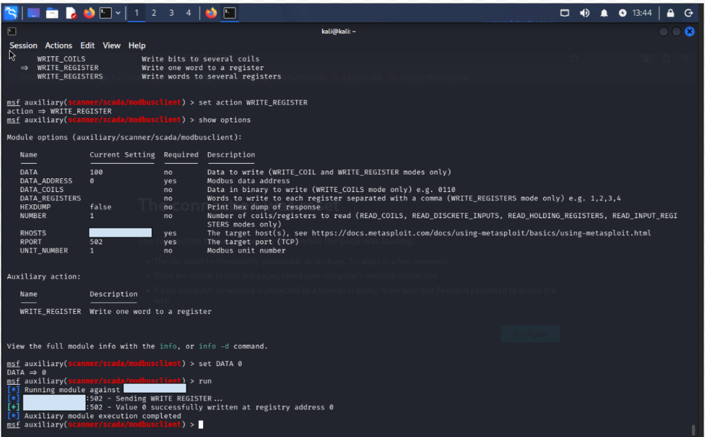
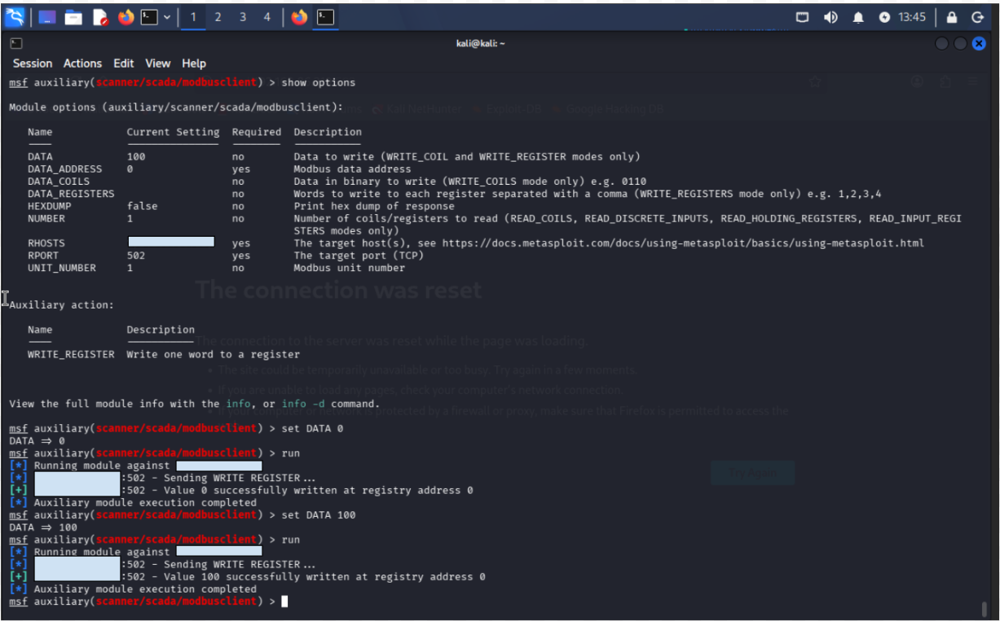
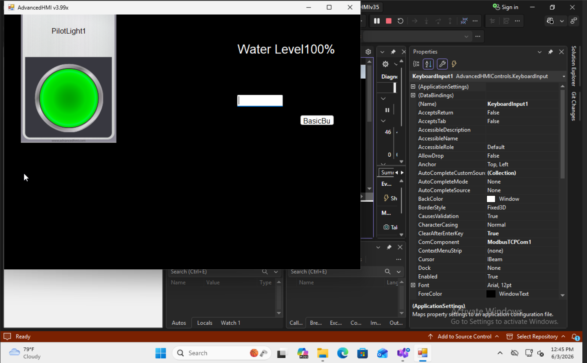
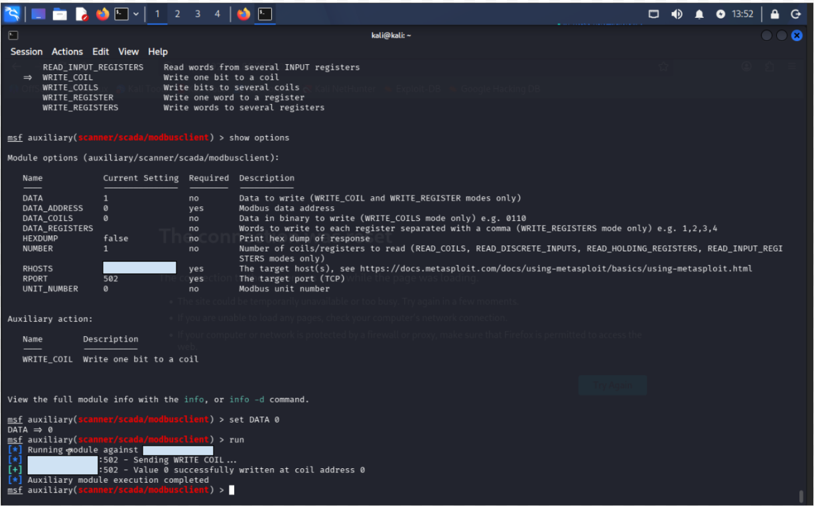
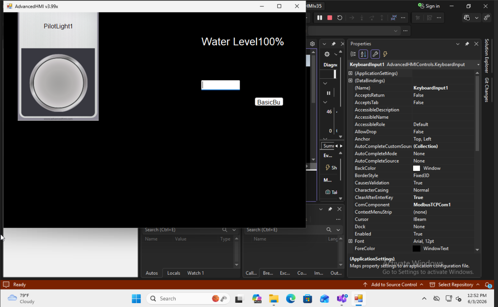

# Attack 2 – Unauthorized Register and Coil Manipulation

## Objective

The goal of Attack 2 was to determine whether process values and control states could be modified remotely without authentication.

Unlike Attack 1, which focused on discovering and reading PLC information, this attack focused on actively manipulating PLC data through Modbus TCP.

The objectives were:

- Modify holding register values
- Modify coil values
- Demonstrate unauthorized process manipulation
- Observe resulting changes on the operator HMI

---

# Background

During Attack 1, I identified an exposed Modbus TCP service and successfully enumerated:

- PLC coil values
- Holding register values
- Simulated process information

The next step was determining whether these values could be modified remotely through Modbus write operations.

Since Modbus TCP does not provide authentication by default, any system with network access to the PLC may be able to issue write commands.

---

# Manipulating a Holding Register

A simulated water-level process had previously been created within OpenPLC.

The HMI displayed the current water level using a Modbus holding register.

The water-level register was mapped to:

```text
Holding Register 0
```

Using Metasploit's Modbus client module, I changed from reading registers to writing registers.

The first test involved changing the water level to:

```text
0%
```

## Figure 1 - Setting Water Level to 0



*Writing a value of 0 to the water-level holding register using Modbus TCP.*

The PLC accepted the write request without requiring authentication.

---

# Manipulating the Water Level

After confirming write access was possible, I modified the water-level register again.

This time I changed the value to:

```text
100%
```

using the WRITE_REGISTER action.

## Figure 2 - Writing a Water Level of 100



*Writing a value of 100 to the water-level holding register using Metasploit.*

Metasploit reported:

```text
Value 100 successfully written at registry address 0
```

indicating the PLC accepted the write request.

---

# Observing Process Manipulation

Immediately after writing the new value, the operator interface reflected the change.

The HMI displayed:

```text
Water Level = 100%
```

even though the operator had not changed the value locally.

## Figure 3 - Manipulated Water Level Display



*The HMI displaying the attacker-controlled water-level value.*

This demonstrated that process data could be manipulated remotely through Modbus communications.

---

# Manipulating a PLC Coil

After successfully modifying holding registers, I tested whether discrete PLC outputs could also be manipulated.

The pilot light was controlled by a PLC coil.

Using the WRITE_COIL action within Metasploit, I wrote:

```text
0
```

to the pilot-light coil.

## Figure 4 - Writing to a PLC Coil



*Writing a value of 0 to the pilot-light coil using Modbus TCP.*

The PLC accepted the request and reported successful execution.

---

# Observing Coil Manipulation

Immediately after the write operation, the pilot light changed state.

The indicator switched from:

```text
ON
```

to:

```text
OFF
```

without any interaction from the operator.

## Figure 5 - Manipulated Pilot Light



*The pilot light turning off after a remote coil write operation.*

This demonstrated that PLC outputs could be directly manipulated through Modbus without authentication.

---

# Security Impact

This attack demonstrated a significant weakness associated with unauthenticated industrial protocols.

An attacker with network access was able to:

- Modify process values
- Change operator-visible information
- Control PLC outputs
- Influence the perceived state of the industrial process

In a real industrial environment, similar actions could impact:

- Tank levels
- Pump operations
- Valve positions
- Alarm states
- Industrial control decisions

---

# Lessons Learned

Through this exercise I learned:

- Reading process information is only the first stage of an ICS attack.
- Modbus TCP allows both read and write operations when access controls are not implemented.
- Holding registers typically store process values such as levels, temperatures, and measurements.
- Coils typically represent binary states such as switches, indicators, and outputs.
- Unauthorized write access can directly impact industrial processes.
- HMI systems often trust data received from the PLC and immediately reflect manipulated values.

---

# Attack Result

Successfully modified PLC holding registers and coil values through Modbus TCP without authentication, causing immediate changes to the operator HMI and demonstrating unauthorized process manipulation.
