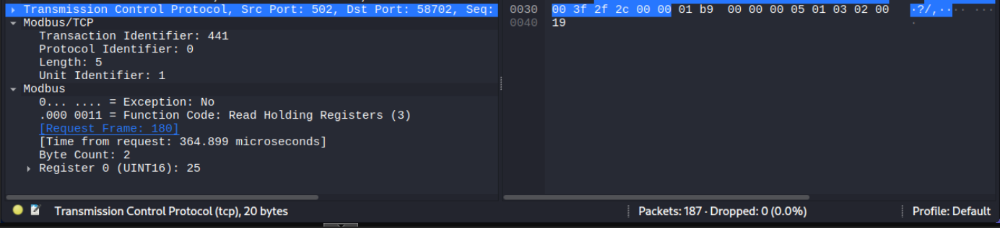
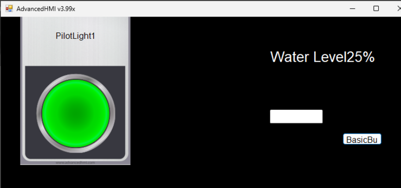

# Attack 3 – Modbus Traffic Interception

## Objective

The objective of this attack was to demonstrate how an attacker located on the same network can intercept communications between an HMI and PLC. By placing the attacker system between the two devices, Modbus TCP traffic could be observed and analyzed to identify process values being exchanged across the network.

## Attack Overview

In this attack, the Kali Linux virtual machine was configured to act as a router between the Windows HMI and Ubuntu PLC. ARP spoofing was used to convince each system that the Kali machine was the other endpoint in the communication path.

Once traffic was redirected through Kali, Wireshark was used to capture and analyze Modbus TCP communications between the HMI and PLC.

---

## Establishing the Man-in-the-Middle Position

The Kali VM was configured to forward network traffic while ARP spoofing was performed against both the Windows HMI and Ubuntu PLC.

The Windows system was led to believe that Kali was the PLC, while the PLC was led to believe that Kali was the Windows HMI. As a result, communications between the two systems were transparently routed through the attacker machine. The below arpspoof commands needed to be run at the same time. 

### Command - Set the kali VM to act like a router

```bash
sudo sysctil -w net.ipv4.ip_forward=1
```

### Command – Kali Positioned Between HMI and PLC

```bash
sudo arpspoof -i eth0 -t <HMI_ip> <OpenPLC_ip>

sudo arpspoof -i eth-0 -t <OpenPLC_ip> <HMI_ip> 
```

*ARP spoofing used to redirect communications through the Kali Linux attacker system.*

---

## Capturing Modbus Traffic

After the man-in-the-middle position was established, Wireshark was used to inspect Modbus TCP traffic flowing between the HMI and PLC.

Analysis of the captured packets revealed Modbus requests and responses containing process information. One captured packet showed that Register 0 contained a value of 25.

### Figure 1 – Captured Modbus Traffic



*Wireshark capture showing Modbus traffic exchanged between the HMI and PLC.*

---

## Correlating Network Traffic with Process Data

The value observed in the Modbus packet was compared to the value displayed on the HMI.

The packet capture showed Register 0 containing a value of 25, while the HMI simultaneously displayed a water level of 25%.

This demonstrated that process values were being transmitted across the network in clear text and could be observed by an attacker with network access.

### Figure 3 – HMI Display



*AdvancedHMI displaying a water level of 25%, matching the value observed within the Modbus packet capture.*

---

## Security Impact

This attack demonstrates a major weakness of Modbus TCP communications. Because Modbus does not provide encryption, authentication, or integrity verification, sensitive operational information can be exposed to anyone capable of intercepting network traffic.

Potential risks include:

* Monitoring industrial process values
* Identifying PLC register mappings
* Gathering intelligence for future attacks
* Manipulating process values in transit
* Disrupting industrial control processes

---

## Conclusion

Attack 3 successfully demonstrated the interception and analysis of Modbus TCP communications between an HMI and PLC. By positioning the Kali Linux system between the communicating devices, network traffic was captured and inspected using Wireshark. The intercepted Modbus packet revealed Register 0 containing a value of 25, which directly matched the 25% water level displayed on the HMI. This attack highlights the security risks associated with legacy industrial protocols that lack encryption and authentication mechanisms.
